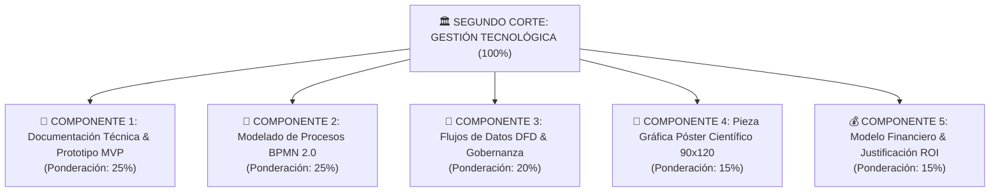

# 📋 Rúbrica Maestra de Evaluación: Segundo Corte (Corte 2)
### Asignatura: Gestión Tecnológica (`Código: 8830 0064 0`)
**Universidad Pontificia Bolivariana — Seccional Montería**  
**Facultad de Ingeniería Industrial // Grupo de Investigación SILOGE // Hub Industrial Solution (HIS)**  
**Docente Titular:** M.Sc. Cristian Javier Cano Mogollón  
**Periodo Académico:** 2026-2 &nbsp;|&nbsp; **Ponderación:** 30% de la Nota Semestral  

---

## 🎯 Estructura de Ponderación de la Tarea

---

## 📄 COMPONENTE 1: Documentación Técnica y Prototipo Funcional MVP (25%)
Evalúa el rigor conceptual del proyecto de Empresa de Base Tecnológica (EBT), el diagnóstico de brecha tecnológica y el grado de avance del prototipo de software o solución técnica.

| Criterio | Peso | Excelente (4.5 - 5.0) | Bueno (3.8 - 4.4) | Aceptable (3.0 - 3.7) | Deficiente (1.0 - 2.9) | Insuficiente (0.0 - 0.9) |
| :--- | :---: | :--- | :--- | :--- | :--- | :--- |
| **1.1 Diagnóstico, Brecha Tecnológica y Metodología** | **40%** | Diagnóstico cuantitativo impecable del sector en Córdoba. Brecha tecnológica (*Technology Gap*) claramente justificada. Enfoque metodológico PRMyD/IMRyD riguroso con citas DOI activas. | Diagnóstico bien estructurado con datos locales del sector. Brecha tecnológica clara con fundamentación bibliométrica adecuada. | Diagnóstico general con escasas métricas del entorno de Montería/Córdoba. Brecha tecnológica difusa. | Diagnóstico meramente descriptivo sin soporte de datos ni bibliometría verificable. | No presenta diagnóstico ni fundamentación metodológica. |
| **1.2 Arquitectura y Desarrollo del Prototipo MVP** | **60%** | Prototipo funcional (Streamlit/FastHTML, Python, BD) con arquitectura modular explicada a fondo: qué se hizo, cómo se desarrolló hacia los objetivos y estado operativo actual. | Prototipo con buena funcionalidad y arquitectura de software clara, con explicación satisfactoria del avance hacia el objetivo. | Prototipo en fase inicial, con pantallas estáticas o escasa interactividad. Explicación técnica básica. | Prototipo no funcional, desarticulado de los objetivos o sin código verificable. | No presenta prototipo ni evidencia de desarrollo tecnológico. |

---

## 🔄 COMPONENTE 2: Modelado de Procesos de Negocio en BPMN 2.0 (25%)
Evalúa la modelación de procesos empresariales bajo el estándar BPMN 2.0, contrastando el estado actual (*As-Is*) frente al estado tecnificado (*To-Be*).

| Criterio | Peso | Excelente (4.5 - 5.0) | Bueno (3.8 - 4.4) | Aceptable (3.0 - 3.7) | Deficiente (1.0 - 2.9) | Insuficiente (0.0 - 0.9) |
| :--- | :---: | :--- | :--- | :--- | :--- | :--- |
| **2.1 Análisis Comparativo As-Is vs To-Be** | **40%** | Contraste riguroso entre el proceso actual y el propuesto. Demuestra visual y operativamente la eliminación de cuellos de botella, mermas y tiempos muertos mediante la tecnología. | Buena diferenciación entre As-Is y To-Be con mejoras claras en las actividades clave del proceso. | Contraste superficial entre procesos; el modelo To-Be no evidencia con claridad el impacto de la tecnología adoptada. | Los modelos As-Is y To-Be son prácticamente idénticos o carecen de lógica de mejora operativa. | No presenta análisis comparativo de procesos. |
| **2.2 Rigor Sintáctico en Notación BPMN 2.0** | **60%** | Notación BPMN 2.0 impecable: Pools y Swimlanes bien asignados por roles, compuertas lógicas con condiciones explícitas, eventos tipificados y flujos de mensajes correctos. | Diagramación BPMN clara y ordenada con pequeñas imprecisiones en tipos de compuertas o eventos intermedios. | Diagrama con fallas de estándar: omite swimlanes, compuertas sin rotular o mezcla flujos de secuencia con flujos de mensajes. | Flujograma rudimentario que no sigue el estándar BPMN 2.0 o presenta errores graves de lógica de proceso. | No entrega diagramas BPMN o son ilegibles. |

---

## 📐 COMPONENTE 3: Diagramas de Flujos de Datos (DFD) y Gobernanza de Datos (20%)
Evalúa la arquitectura de información y la estrategia integral de gestión de activos de datos bajo principios DAMA-DMBOK.

| Criterio | Peso | Excelente (4.5 - 5.0) | Bueno (3.8 - 4.4) | Aceptable (3.0 - 3.7) | Deficiente (1.0 - 2.9) | Insuficiente (0.0 - 0.9) |
| :--- | :---: | :--- | :--- | :--- | :--- | :--- |
| **3.1 Diagramas DFD (Niveles 0, 1 y 2)** | **50%** | Jerarquía de DFD completa y balanceada: Contexto (0), Subsistemas (1) y Proceso Crítico (2). Entidades, procesos, almacenes y flujos consistentes. | DFD bien estructurado en Niveles 0 y 1 con buen detalle en Nivel 2, presentando leves inconsistencias de balance. | DFD incompleto (solo Nivel 0 o 1) con errores en la representación de almacenes o flujos de datos. | Diagrama confuso que confunde flujos de datos con flujos de control o no respeta la simbología canónica. | No presenta diagramas DFD. |
| **3.2 Marco de Gobernanza de Datos (DAMA-DMBOK)** | **50%** | Diccionario de datos exhaustivo con metadatos y reglas de integridad. Linaje del dato mapeado. Dimensiones de calidad y políticas de seguridad RBAC formalizadas. | Diccionario estructurado, linaje de datos identificado y políticas de calidad y seguridad bien orientadas a la EBT. | Gobernanza abordada de forma teórica; diccionario de datos incompleto o sin métricas de calidad objetivas. | Lista dispersa de variables sin marco de gobernanza, trazabilidad ni políticas de seguridad. | No presenta marco de gobernanza de datos. |

---

## 🎨 COMPONENTE 4: Pieza Gráfica Institucional — Póster Científico 90x120 cm (15%)
Evalúa el cumplimiento de identidad corporativa, síntesis visual y calidad técnica de la pieza gráfica.

| Criterio | Peso | Excelente (4.5 - 5.0) | Bueno (3.8 - 4.4) | Aceptable (3.0 - 3.7) | Deficiente (1.0 - 2.9) | Insuficiente (0.0 - 0.9) |
| :--- | :---: | :--- | :--- | :--- | :--- | :--- |
| **4.1 Identidad Institucional y Especificaciones (90x120)** | **50%** | Cumple estrictamente las dimensiones **90 cm $\times$ 120 cm** vertical. Presencia nítida de los tres logos oficiales (**UPB**, **HIS**, **SILOGE**). Título formal de ingeniería. | Cumple dimensiones 90x120 cm. Presenta los tres logotipos oficiales con buena resolución y título estructurado. | Dimensiones cercanas o falta uno de los 3 logos oficiales en la cabecera. | Formato no estándar (ej. tamaño carta o apaisado). Ausencia de dos o más logotipos institucionales. | No entrega póster científico o no utiliza la plantilla institucional. |
| **4.2 Calidad Visual, Diagramas y Tarjeta de KPI Financiero** | **50%** | Diagramas BPMN/DFD legibles, capturas del prototipo de alta calidad. Tarjeta destacada con KPI de ROI y Payback. Código QR interactivo funcional. | Muy buena diagramación y legibilidad. Incluye métricas de ROI y código QR activo. | Póster sobrecargado de texto o con figuras de baja resolución. Tarjeta de ROI poco destacada. QR ausente. | Presentación desordenada con imágenes distorsionadas y sin métricas financieras visibles. | Presentación ilegible o sin rigor gráfico. |

---

## 💰 COMPONENTE 5: Modelo Financiero y Justificación del ROI (15%)
Evalúa la viabilidad económica y el impacto financiero cuantificado de la adopción tecnológica en la EBT.

| Criterio | Peso | Excelente (4.5 - 5.0) | Bueno (3.8 - 4.4) | Aceptable (3.0 - 3.7) | Deficiente (1.0 - 2.9) | Insuficiente (0.0 - 0.9) |
| :--- | :---: | :--- | :--- | :--- | :--- | :--- |
| **5.1 Justificación Financiera, ROI y Periodo de Retorno** | **100%** | Rigurosa discriminación de CAPEX y OPEX. Beneficios económicos justificados empíricamente (ahorro de tiempo, mermas, optimización). Cálculo exacto de ROI y Payback en meses. | Buen desglose de CAPEX/OPEX y beneficios justificados. Cálculo de ROI y Payback correctos con supuestos plausibles. | Estructura financiera básica. Ahorros calculados con supuestos no fundamentados o sin estimar el tiempo de recuperación. | Confunde beneficio bruto con neto o calcula erróneamente la fórmula del ROI. | No presenta análisis financiero ni cálculo de ROI. |

---

## 🧮 Matriz de Consolidación Numérica para la Plataforma ZERO

$$\text{Nota Final Corte 2} = (N_1 \times 0.25) + (N_2 \times 0.25) + (N_3 \times 0.20) + (N_4 \times 0.15) + (N_5 \times 0.15)$$

| Equipo EBT | Nota 1: Doc. & MVP (25%) | Nota 2: BPMN (25%) | Nota 3: DFD & Gob. (20%) | Nota 4: Póster 90x120 (15%) | Nota 5: ROI (15%) | **Calificación Final Corte 2 (0.0 - 5.0)** |
| :---: | :---: | :---: | :---: | :---: | :---: | :---: |
| **Equipo XX** | $[0.0 - 5.0]$ | $[0.0 - 5.0]$ | $[0.0 - 5.0]$ | $[0.0 - 5.0]$ | $[0.0 - 5.0]$ | **$[0.0 - 5.0]$** |

---
*Facultad de Ingeniería Industrial — Grupo de Investigación SILOGE — Universidad Pontificia Bolivariana Seccional Montería*
