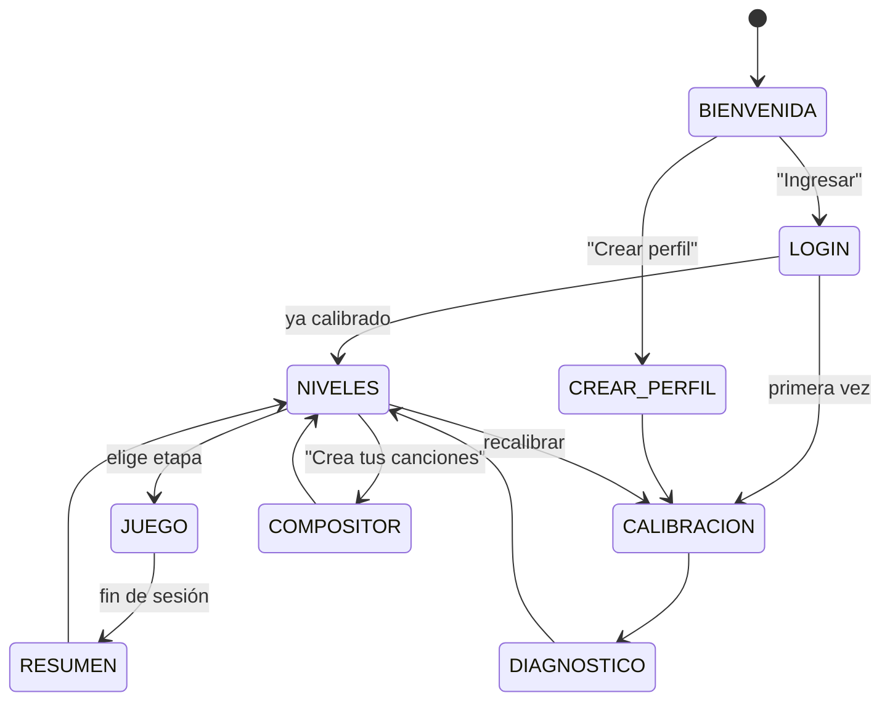
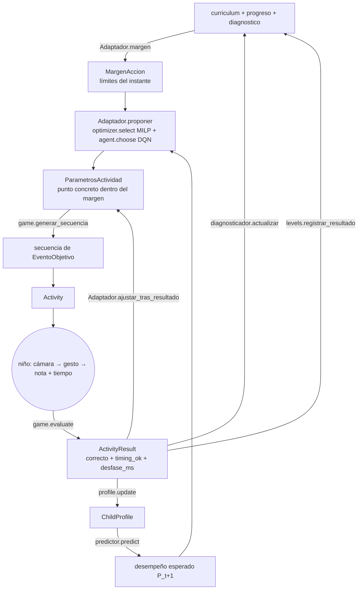

# Arquitectura técnica y flujo de usuario — Hand Sing Music

> **Entregable 2 de 3.** Define *cómo está construida* la app y *cómo encajan las
> piezas*. Este documento describe **contratos** (interfaces, dataclasses,
> responsabilidades); la implementación de cada uno llega por fases.
> Depende del Entregable 1 ([Ruta de Aprendizaje Musical](01_ruta_aprendizaje_musical.md)).

---

## 1. Stack y estructura

**Decidido (2026-09-09):** se extiende el proyecto Python existente. Nada de
React/TF.js.

| Capa | Tecnología | Módulos |
|---|---|---|
| Visión / gestos | OpenCV + MediaPipe Hands | `vision.py`, `calibration.py`, `recognizer.py` |
| Juego / UI | Pygame | `game.py`, `screens.py` |
| Dominio | Python puro (dataclasses) | `auth.py`, `levels.py`, `composer.py`, `diagnostics.py`, `curriculum.py` |
| Adaptación | TensorFlow/Keras · PuLP (MILP) · Gymnasium + Stable-Baselines3 (DQN) | `adaptive/` |
| Persistencia | JSON en disco (atómico) | `persistence.py` |

Regla del proyecto (§42): **cada módulo funciona aislado antes de conectarlo.**
Por eso todos nacen como esqueleto (`raise NotImplementedError("Fase N: …")`) y
`main.py` ya refleja la arquitectura final.

```
Prototipo/
├── main.py           orquesta; --stage {vision,calibration,profile,adaptive,app,full}
├── config.py         constantes: notas, rutas, pantallas, auth, umbrales
├── curriculum.py     ← Entregable 1: qué se aprende y en qué orden (fuente de verdad)
│
├── screens.py        máquina de estados del flujo (Pantalla, TRANSICIONES, App)
├── auth.py           Perfil, AuthService (alta / login, hash PBKDF2)
├── persistence.py    Store (JsonStore | MemoryStore), escritura atómica
├── diagnostics.py    Diagnostico, Diagnosticador ("diagnóstico general")
├── levels.py         ProgresoJugador, GestorNiveles (desbloqueo de etapas)
├── composer.py       Cancion, Editor (modo nivel / libre, grabar, guardar)
│
├── vision.py         HandVision: cámara + landmarks
├── calibration.py    Calibrator: calibración automática de gestos del niño
├── recognizer.py     GestureRecognizer: landmarks → gesto → nota
├── game.py           Activity, ActivityResult, MusicGame (dinámicas, evaluación)
│
├── adaptive/
│   ├── profile.py    ChildProfile, StateVector S_t
│   ├── adapter.py    ← NUEVO: MargenAccion + ParametrosActividad + Adaptador
│   ├── predictor.py  Predictor (Keras): P_(t+1) = f(S_t, A_t)
│   ├── optimizer.py  ActivityOptimizer (MILP): selección de actividad
│   ├── environment.py HandSingMusicEnv (Gymnasium): estado → acción → recompensa
│   └── agent.py      AdaptiveAgent (DQN): estrategia a largo plazo
│
└── digital_twin/twin.py   DigitalTwin: simula al niño para entrenar el RL offline
```

---

## 2. Componentes principales y sus contratos

### 2.1 Autenticación — `auth.py`

| Tipo | Contrato |
|---|---|
| `Perfil` | `user_id` (opaco, estable), `nombre`, `edad`, `avatar`; credencial (`_password_hash`, `_salt`) nunca sale de `auth`. `.publico()` = vista sin credenciales. |
| `AuthService(store)` | `crear_perfil(nombre, edad, password, avatar) → Perfil` · `login(nombre, password) → Perfil` · `logout()` · `existe(nombre)` · `perfiles() → list[dict]` · `cambiar_password(...)`. Lanza `AuthError` con mensaje apto para un niño. |

Seguridad: PBKDF2-HMAC-SHA256, `config.PBKDF2_ITERACIONES`, sal por usuario.

### 2.2 Persistencia — `persistence.py`

`Store` (Protocol): `leer/escribir/existe/borrar/listar`.
`JsonStore(base_dir=config.DATA_DIR)` — escritura atómica (`tmp` + `os.replace`),
`_schema_version` inyectado, guardas anti *path-traversal*.
`MemoryStore` — **ya funcional**, para tests.
Rutas relativas con `/`: `users/<id>`, `progress/<id>`, `diagnostics/<id>`,
`songs/<id>/<song_id>`, `sessions/<id>/<ts>`.

### 2.3 Diagnóstico general — `diagnostics.py`

Responde: **¿qué domina el niño, qué le cuesta, dónde debería estar?** No decide
la siguiente actividad.

| Tipo | Contrato |
|---|---|
| `DominioNota` / `DominioRitmo` | intentos, aciertos, precisión, latencia/desfase, `estado ∈ config.ESTADOS_DOMINIO` (`nuevo/en_progreso/fragil/dominado`). |
| `Diagnostico` | `etapa_estimada`, `etapa_max_desbloqueada`, `dominio_notas`, `dominio_ritmos`, `fortalezas`, `dificultades`, `tendencia`, `perfil_aprendizaje ∈ config.PERFILES_APRENDIZAJE`, `ritmo_vs_notas`, `recomendacion` (texto para adultos), `confianza`. `.metricas_avance()` → dict para `curriculum.puede_avanzar`. |
| `prueba_diagnostica() → list[ItemDiagnostico]` | prueba de colocación adaptativa (`config.PRUEBA_DIAGNOSTICA_ITEMS` ítems, tipo búsqueda binaria sobre el currículo). |
| `Diagnosticador(store)` | `diagnostico_inicial(user_id, respuestas)` · `actualizar(diag, result)` (incremental) · `resumen_sesion(user_id, profile)` · `etapa_recomendada(diag)` · `notas_fragiles(diag)` · `clasificar_perfil(diag)` (alimenta el gemelo digital) · `cargar/guardar`. |

### 2.4 Gestor de niveles — `levels.py`

| Tipo | Contrato |
|---|---|
| `ProgresoEtapa` | por etapa: `desbloqueada`, `completada`, `actividades_hechas`, `mejor_precision`, `mejor_timing`, `estrellas` (0–3), `ultima_dificultad`. |
| `ProgresoJugador` | `user_id`, `etapa_actual`, `etapas: dict[int, ProgresoEtapa]`, `total_canciones_creadas`. `.desbloqueadas()`, `.estrellas_totales()`. |
| `GestorNiveles(store, diagnosticador)` | `cargar/guardar/nuevo` · `registrar_resultado(progreso, result, diag) → ProgresoJugador` · `evaluar_avance(...)` (delega en `curriculum.puede_avanzar`) · `desbloquear_siguiente(...)` (idempotente, **nunca re-bloquea**) · `seleccionar_etapa(...)` (solo desbloqueadas) · `resumen_ui(...)` → filas para la pantalla de niveles. |

### 2.5 Editor de canciones — `composer.py`

| Tipo | Contrato |
|---|---|
| `EventoCancion` | `figura` (nombre de `curriculum.Figura`), `nota` (`None` = silencio), `inicio_pulso`, `duracion_pulsos`. Tiempo en **pulsos**, no segundos → independiente del tempo. |
| `Cancion` | `song_id`, `user_id`, `titulo`, `modo ∈ {nivel, libre}`, `etapa_id`, `compas`, `bpm`, `eventos`, `origen ∈ {editor, grabacion}`. |
| `Editor(store, user_id, modo, etapa_id)` | `paleta()` (= `curriculum.paleta_editor`) · `nueva/agregar_evento/quitar_evento/mover_evento` · `validar() → list[str]` · grabación: `iniciar_grabacion(bpm) → registrar_gesto(nota, t) → detener_grabacion() → Cancion` · `reproducir()` · `guardar(titulo)` · `listar/cargar/borrar` (estáticos). Lanza `ComposerError` fuera de paleta. |

### 2.6 Flujo de pantallas — `screens.py`

`Pantalla` (Enum) = `config.PANTALLAS`.
`TRANSICIONES: dict[Pantalla, tuple[Pantalla, …]]` — grafo de transiciones legales.
`REQUISITOS: dict[Pantalla, tuple[str, …]]` — claves de `ContextoApp` que deben
existir para entrar (p. ej. `NIVELES` exige `perfil`, `calibracion`, `progreso`).
`ContextoApp` — estado compartido: `perfil`, `calibracion`, `diagnostico`,
`progreso`, `etapa_seleccionada`, `modo_compositor`.
`App(componentes)` — `puede_ir_a` / `ir_a` / `atras` / `run()` + un handler por
pantalla. `ir_a` ilegal → `TransicionInvalida`.

---

## 3. Flujo técnico: los 5 pasos → pantallas → componentes



| Paso del diseño | Pantalla(s) | Componentes | Qué produce en `ContextoApp` |
|---|---|---|---|
| **1. Ingreso** | `BIENVENIDA → LOGIN / CREAR_PERFIL` | `auth.AuthService`, `persistence` | `perfil` |
| **2. Calibración** | `CALIBRACION` | `vision.HandVision`, `calibration.Calibrator` | `calibracion` (`CalibrationProfile`) |
| — colocación | `DIAGNOSTICO` | `diagnostics.Diagnosticador` (`prueba_diagnostica`) | `diagnostico`; siembra `progreso` |
| **3. Niveles** | `NIVELES` | `levels.GestorNiveles` | `etapa_seleccionada` |
| **4. Creación** | `COMPOSITOR` | `composer.Editor` (+ `vision` en grabación) | `Cancion` en `songs/<id>/` |
| **5. Progreso / dificultad** | `JUEGO → RESUMEN` | `game.MusicGame` + `adaptive.Adaptador` + `diagnostics` + `levels` | `progreso` y `diagnostico` actualizados |

---

## 4. El bucle de juego (paso 5, en detalle)



### 4.1 Lógica de progresión adaptativa — el «margen de acción»

El encargo pide *pensar de forma parametrizada*. La pieza central es
`adaptive/adapter.py`:

1. **`MargenAccion`** = la caja dentro de la que la IA puede moverse **ahora**.
   Sale solo del currículo + progreso + diagnóstico:
   - `rango: curriculum.RangoDificultad` — min/max de 7 ejes continuos
     (`bpm`, `n_eventos`, `densidad`, `p_lectura`, `p_salto`, `tol_ms`, `ayudas`),
     interpolado con `curriculum.interpolar_rango(etapa, progreso)`.
   - `notas`, `figuras`, `dinamicas`, `compases` desbloqueados.
   - `notas_a_reforzar` (frágiles del diagnóstico), `max_notas_nuevas` (normalmente 1).

2. **`ParametrosActividad`** = el punto concreto elegido dentro de la caja.
   `Adaptador.proponer(profile, diagnostico, margen)`:
   - `predictor.predict(profile)` → desempeño esperado.
   - `intensidad_desde_desempeno(esperado, objetivo=0.8)` → un escalar `t ∈ [0,1]`
     (política de dificultad objetivo: si va a acertar de sobra, subir; si va
     justo, mantener; si va a fallar, bajar).
   - `punto_en_rango(rango, t)` → primer borrador de todos los parámetros.
   - `optimizer.select(...)` (MILP con `SessionConstraints.desde_margen`) afina la
     mezcla de notas/figuras/dinámica respetando restricciones de sesión.
   - `agent.choose(profile)` (DQN) sesga la decisión a largo plazo
     (`aumentar_dificultad` / `introducir_nueva_nota` / `repetir` …).
   - Garantiza `resultado.dentro_de(margen)`.

3. **Bucle rápido**: `ajustar_tras_resultado(params, result)` mueve `bpm`,
   `tol_ms`, `n_eventos` o `ayudas` **un paso** para la siguiente actividad de la
   misma sesión, sin re-resolver el MILP. Sigue dentro del margen.

4. **Simulación**: `simular_estrategia(...)` usa `digital_twin` para un rollout
   "¿qué pasaría si…?" antes de comprometer una acción.

### 4.2 Avance de etapa (no de dificultad)

`levels.GestorNiveles.registrar_resultado` acumula en `ProgresoEtapa`; cuando
`curriculum.puede_avanzar(diagnostico.metricas_avance())` es `True` sobre las
últimas `curriculum.VENTANA_AVANCE` actividades → `desbloquear_siguiente()`.
Bajar de desempeño **nunca** re-bloquea: la IA baja la dificultad *dentro* de la
etapa (acciones `disminuir_dificultad` / `repetir_actividad`).

---

## 5. Persistencia — esquemas JSON

Todos bajo `Prototipo/data/` (ignorado por git). `_schema_version = 1`.

| Archivo | Dataclass raíz | Campos clave |
|---|---|---|
| `users/<id>.json` | `auth.Perfil` | `user_id`, `nombre`, `edad`, `avatar`, `_password_hash`, `_salt` |
| `calibration/<id>.json` | `calibration.CalibrationProfile` | `references: {nota: [float]}`, `hand_scale` |
| `diagnostics/<id>.json` | `diagnostics.Diagnostico` | `etapa_estimada`, `dominio_notas`, `dominio_ritmos`, `confianza` |
| `progress/<id>.json` | `levels.ProgresoJugador` | `etapa_actual`, `etapas: {id: ProgresoEtapa}` |
| `sessions/<id>/<ts>.json` | lista de `game.ActivityResult` | registro crudo para entrenar `predictor` |
| `songs/<id>/<song_id>.json` | `composer.Cancion` | `modo`, `bpm`, `compas`, `eventos` |

Serialización: `persistence.to_dict` / `from_dict` (dataclasses anidadas ↔ dict,
fechas ISO). Migraciones: `persistence.migrar(datos, destino)`.

---

## 6. Estado de implementación (fases)

| Módulo | Fase | Estado |
|---|---|---|
| `curriculum.py` | Entregable 1 | ✅ **implementado + tests** |
| `vision.py` (cámara + MediaPipe, 2 APIs) | 2 | ✅ **implementado** (cámara real verificada) |
| `recognizer.py` (coseno sobre plantillas de 2 manos) | 3 | ✅ **implementado + tests** |
| `calibration.py` (captura/guarda/carga señas) | 3–4 | ✅ **implementado + tests** (captura manual; Fase 4 = automática) |
| `rhythm/` (engine · detector · evaluator) | 1 | ✅ **implementado + tests** (heredado de MusicaManos) |
| `persistence.MemoryStore` | 5 | ✅ funcional (para tests) |
| `screens` grafo (`TRANSICIONES`, `REQUISITOS`) | 12 | ✅ datos definidos + tests de coherencia |
| `config` (notas DO3-DO4, pantallas, auth, umbrales) | — | ✅ |
| Resto (`auth`, `diagnostics`, `levels`, `composer`, `adapter`, `screens.App`, `game`, `persistence.JsonStore`, `adaptive/*`) | 1–12 | ⬜ contrato definido, cuerpo `NotImplementedError` |

Orden de implementación sugerido (ver `docs/03_integracion_prototipo.md` §4):
`persistence.JsonStore` → `auth` → `game` (rebanada jugable con
`vision`+`recognizer` reales) → `diagnostics` → `levels` → `screens.App`
→ `composer` → `adaptive/` → `adapter`.

---

## 7. Pendientes

1. ~~Mapa gesto → nota~~ → **RESUELTO** (señas de dos manos, similitud coseno).
   `recognizer.py` / `calibration.py` / `rhythm/` implementados y con tests. Ver
   `docs/03_integracion_prototipo.md`.
2. Entregable 3: especificaciones visuales a partir de la imagen de referencia
   (paleta, tipografía, layout por pantalla, personaje pingüino, animaciones).
3. Confirmar el orden de implementación y si la rebanada ejecutable debe usar
   cámara real o un `FakeVision` que inyecta gestos por teclado.
