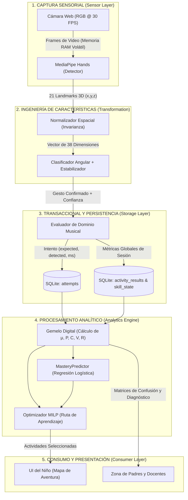
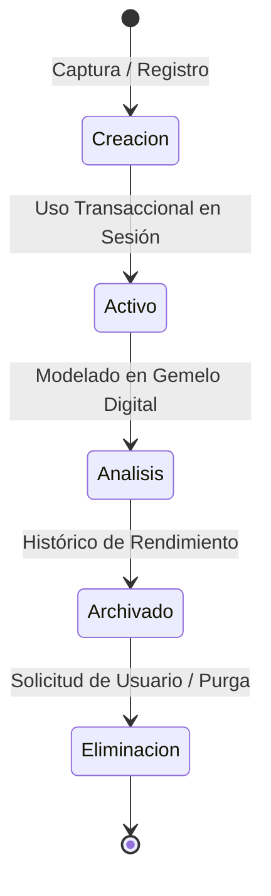

# Capítulo 6: Marco de Gobernanza de Datos (Data Governance)

**Estándares de Referencia:** DAMA-DMBOK v2 / ISO 8000 (Data Quality) / ISO/IEC 27001  
**Sistema:** Hand Sing Kids (v2.0)  
**Entorno de Operación:** Procesamiento Edge Local (Zero Cloud / On-Premise Sandbox)  
**Fecha:** Septiembre 2026  

---

## 1. Introducción y Principios de Gobernanza

El presente marco formal de Gobernanza de Datos establece las directrices, arquitecturas, políticas de calidad, seguridad y ciclo de vida de los datos para la plataforma educativa **Hand Sing Kids**, rigiéndose rigurosamente por las mejores prácticas del **DAMA-DMBOK (Data Management Body of Knowledge)** y la norma internacional **ISO 8000** sobre calidad de datos maestros y transaccionales.

### Principios Rectores
1. **Privacidad por Diseño y por Defecto (*Privacy by Design*):** Ningún fotograma ni flujo de video sale de la memoria RAM de procesamiento; el almacenamiento se restringe estrictamente a descriptores vectoriales no reconstructivos y registros analíticos.
2. **Soberanía y Aislamiento de Datos:** Arquitectura *Local-First / Edge Computing*, sin telemetría externa no consentida ni dependencias de nube.
3. **Calidad Medible:** Monitorización y control continuo de las dimensiones de integridad, exactitud, completitud y oportunidad según ISO 8000-61.

---

## 2. Catálogo y Diccionario de Datos

El repositorio de datos se gestiona mediante un motor relacional embebido **SQLite 3 (modo WAL - Write-Ahead Logging)** con llaves foráneas estrictas (`PRAGMA foreign_keys = ON;`).

A continuación se detalla la tabla técnica de metadatos de las entidades del modelo:

### 2.1 Tabla de Metadatos: Entidades Principales

| Entidad / Tabla | Nombre de Variable | Tipo de Dato | Longitud / Rango | Descripción Operativa | Reglas de Validación e Integridad | Fuente de Captura |
|---|---|---|---|---|---|---|
| **profiles** | `id` | `INTEGER` | 64-bit int | Identificador único del perfil del menor | PK, Autoincremental, No Nulo | Sistema (Generado) |
| **profiles** | `name` | `TEXT` | 1 - 50 chars | Nombre de pila o alias del niño/a | `NOT NULL`, Sanitizado sin caracteres especiales | Formulario UI (Registro) |
| **profiles** | `age` | `INTEGER` | [3, 12] | Edad cronológica para calibración de dificultad | `CHECK(age >= 3 AND age <= 12)` | Formulario UI (Registro) |
| **profiles** | `avatar` | `TEXT` | 1 - 30 chars | Clave identificadora del personaje gráfico | `NOT NULL`, Default `'iguana'` | Formulario UI (Selección) |
| **profiles** | `created_at` | `REAL` | Epoch Unix | Marca de tiempo de registro del perfil | `NOT NULL`, $> 0$ | Reloj del Sistema (`time.time()`) |
| **profiles** | `last_seen_at` | `REAL` | Epoch Unix | Marca de tiempo de última actividad | `NOT NULL`, $\ge \text{created\_at}$ | Reloj del Sistema (`time.time()`) |
| **profiles** | `stars` | `INTEGER` | $\ge 0$ | Total acumulado de estrellas (gamificación) | `DEFAULT 0`, `CHECK(stars >= 0)` | Motor de Recompensas |
| **profiles** | `streak_days` | `INTEGER` | $\ge 0$ | Días continuos de práctica registrados | `DEFAULT 0`, `CHECK(streak_days >= 0)` | Evaluador de Sesión |
| **profiles** | `calibrated` | `INTEGER` | $\{0, 1\}$ | Bandera booleana de calibración completada | `DEFAULT 0`, `CHECK(calibrated IN (0,1))` | Módulo de Calibración |
| **skill_state** | `profile_id` | `INTEGER` | 64-bit int | Llave foránea del perfil asociado | `FK -> profiles(id) ON DELETE CASCADE` | Sesión Activa |
| **skill_state** | `skill_code` | `TEXT` | 1 - 20 chars | Código de la habilidad musical (ej. `solfa_do3`) | `FK -> skills(code)`, `NOT NULL` | Catálogo de Habilidades |
| **skill_state** | `status` | `TEXT` | Enum | Estado: `bloqueada`, `introducida`, `practicando`, `dominada`, `consolidada` | `NOT NULL`, Valores restringidos por Enum | Motor de Dominio |
| **skill_state** | `mastery` | `REAL` | $[0.0, 1.0]$ | Índice compuesto de dominio de la habilidad $\mu_s$ | `CHECK(mastery >= 0.0 AND mastery <= 1.0)` | Motor de Aprendizaje |
| **skill_state** | `precision_v` | `REAL` | $[0.0, 1.0]$ | Tasa de acierto ponderada histórica | `CHECK(precision_v >= 0.0 AND precision_v <= 1.0)` | Gemelo Digital |
| **skill_state** | `consistency` | `REAL` | $[0.0, 1.0]$ | Estabilidad del rendimiento en ventana deslizante | `CHECK(consistency >= 0.0 AND consistency <= 1.0)` | Gemelo Digital |
| **skill_state** | `speed` | `REAL` | $[0.0, 1.0]$ | Velocidad de reacción normalizada neuromotriz | `CHECK(speed >= 0.0 AND speed <= 1.0)` | Gemelo Digital |
| **skill_state** | `retention` | `REAL` | $[0.0, 1.0]$ | Retención mnemotécnica actual proyectada | `CHECK(retention >= 0.0 AND retention <= 1.0)` | Modelo Ebbinghaus / SM-2 |
| **skill_state** | `mean_reaction_ms`| `REAL` | $\ge 0.0$ | Latencia promedio de reconocimiento en ms | `DEFAULT 0.0` | Pipeline de Visión / Timer |
| **skill_state** | `due_at` | `REAL` | Epoch Unix | Fecha límite proyectada para el próximo repaso | Unix Timestamp, `DEFAULT 0` | Algoritmo Repaso Espaciado |
| **attempts** | `id` | `INTEGER` | 64-bit int | Identificador único del intento | PK, Autoincremental | Sistema (Transaccional) |
| **attempts** | `profile_id` | `INTEGER` | 64-bit int | Llave foránea del perfil ejecutor | `FK -> profiles(id) ON DELETE CASCADE` | Contexto de Usuario |
| **attempts** | `expected` | `TEXT` | 1 - 10 chars | Nota musical objetivo (ej. `DO3`) | `NOT NULL`, Código de nota válido | Secuencia de Actividad |
| **attempts** | `detected` | `TEXT` | 1 - 10 chars | Nota clasificada por el sistema de visión | Puede ser `NULL` si expiró el tiempo | Clasificador de Visión |
| **attempts** | `confidence` | `REAL` | $[0.0, 1.0]$ | Nivel de confianza angular del clasificador | `CHECK(confidence >= 0.0 AND confidence <= 1.0)`| Clasificador $k$-NN / Cosine |
| **attempts** | `correct` | `INTEGER` | $\{0, 1\}$ | Evaluación binaria del intento | `CHECK(correct IN (0, 1))` | Evaluador Musical |
| **attempts** | `reaction_ms`| `INTEGER` | $[0, 30000]$ | Tiempo transcurrido desde estímulo hasta seña | `NOT NULL`, medido en milisegundos | Timer de Precisión |
| **activity_results**| `accuracy` | `REAL` | $[0.0, 100.0]$ | Porcentaje global de aciertos de la actividad | `CHECK(accuracy >= 0.0 AND accuracy <= 100.0)` | Evaluador de Actividad |

---

## 3. Linaje del Dato (*Data Lineage*)

El linaje describe la trazabilidad integral de los datos de extremo a extremo: desde la captura física del sensor óptico en el dispositivo hasta el consumo analítico en el panel de control educativo.

### 3.1 Diagrama Gráfico de Linaje de Datos



### 3.2 Matriz de Trazabilidad Extremo a Extremo

| Etapa del Linaje | Proceso de Transformación | Entrada de Datos | Salida Generada | Destino / Consumidor | Clasificación de Seguridad |
|---|---|---|---|---|---|
| **1. Ingesta** | Captura de frames de cámara y detección de topología manual | Video RGB no estructurado | Coordenadas $(x,y,z)$ relativas a la escena | Memoria volátil (`RAM`) | Efímero (Destrucción inmediata) |
| **2. Normalización** | Traslación de origen a muñeca y escalamiento euclidiano | 21 puntos crudos por mano | Vector de características invariante ($\mathbb{R}^{38}$) | Clasificador de Visión | Efímero (Memoria de proceso) |
| **3. Clasificación** | Comparación angular contra plantillas y filtro de histéresis | Vector normalizado | Nota predicha + Valor de confianza | Evaluador de Dominio | Transaccional de aplicación |
| **4. Evaluación** | Comparación con secuencia esperada y medición de latencia | Nota detectada + Timestamp | Registro de acierto y $T_{\text{reacción}}$ | Tabla `attempts` en SQLite | Persistente (Disco Local) |
| **5. Modelado** | Ajuste de retención (Ebbinghaus) y cálculo de vector de destreza | Histórico de intentos de la seña | Vector de destreza $(\mu, P, C, V, R)$ | Tabla `skill_state` | Persistente (Disco Local) |
| **6. Optimización** | Resolución de programación lineal entera mixta (MILP) | Gemelo digital + Catálogo de actividades | Ruta diaria de actividades | UI Pantalla de Inicio / Aventura | En memoria de sesión |
| **7. Exposición** | Agregación de confusiones y tendencias de aprendizaje | Consultas analíticas SQL agregadas | Gráficas e indicadores pedagógicos | Pantalla `Zona de Padres` | Interfaz de Usuario Local |

---

## 4. Dimensiones y Métricas de Calidad del Dato (ISO 8000 / DAMA)

Para garantizar la alta fidelidad analítica de las decisiones didácticas, se definen indicadores de calidad objetivos conforme a **ISO 8000-61**:

```
┌─────────────────────────────────────────────────────────────────────────────────────────────┐
│                                DIMENSIONES DE CALIDAD DEL DATO                              │
├─────────────────────────────────────────────────────────────────────────────────────────────┤
│   COMPLETITUD        EXACTITUD          CONSISTENCIA       OPORTUNIDAD                      │
│   • 0% nulos PK/FK   • Error < 35ms     • FK Cascade       • Latencia < 50ms                │
│   • Cobertura 100%   • Confianza > 0.70 • [0.0, 1.0] Dom.  • Actualización Sync             │
└─────────────────────────────────────────────────────────────────────────────────────────────┘
```

| Dimensión de Calidad | Indicador Objetivo / Métrica | Fórmula de Cálculo | Umbral de Aceptación | Mecanismo de Control / Mitigación |
|---|---|---|---|---|
| **Completitud** | Porcentaje de campos críticos no nulos en transacciones | $\text{Comp} = \left(1 - \frac{\text{Valores Nulos}}{\text{Total Registros Esperados}}\right) \times 100$ | **$100\%$** en llaves y métricas; $\ge 99.5\%$ en general | Restricciones `NOT NULL` a nivel de esquema DDL en SQLite. |
| **Exactitud** | Margen de error en la medición de tiempos y clasificación | $\text{Error}_{\text{tiempo}} = |T_{\text{medido}} - T_{\text{real}}|$; $\text{Acc}_{\text{visión}} = \frac{\text{GTP}}{\text{Total}}$ | Error tiempo $< 5\,\text{ms}$; Confianza clasificación $\ge 0.70$ | Sincronización mediante `time.perf_counter()`; filtro de histéresis temporal. |
| **Consistencia** | Cumplimiento de reglas relacionales y rangos válidos | $\text{Cons} = \frac{\text{Registros con Integridad Referencial Válida}}{\text{Total de Registros}} \times 100$ | **$100\%$** | `PRAGMA foreign_keys = ON;`, constraints de tipo `CHECK` en todas las tablas. |
| **Oportunidad** | Latencia de actualización del Gemelo Digital tras un intento | $\text{Latencia} = T_{\text{persistencia}} - T_{\text{evento}}$ | **$< 50\,\text{ms}$** | Modo SQLite `WAL` (Write-Ahead Logging) con escrituras asíncronas no bloqueantes. |

---

## 5. Seguridad, Privacidad y Ciclo de Vida del Dato

### 5.1 Matriz de Control de Acceso Basado en Roles (RBAC)

El acceso a las funcionalidades y datos del sistema está regulado según el principio de privilegio mínimo (*Least Privilege*):

| Rol / Perfil de Acceso | Perfiles y Configuración Básica | Intentos y Transacciones (`attempts`) | Gemelo Digital y Diagnóstico (`skill_state`) | Configuración del Sistema (`meta`) | Video / Sensor en Vivo |
|---|---|---|---|---|---|
| **Aprendiz (Niño)** | Lectura / Escritura de su propio avatar y nombre | Creación automática (Inserción en tiempo real) | Solo lectura de nivel y estrellas | Sin acceso | Uso en memoria (Sin guardado) |
| **Padre / Tutor** | Creación, Edición y Eliminación completa | Consulta analítica agregada | Lectura detallada de destrezas y diagnósticos | Lectura / Edición de preferencias | Sin acceso |
| **Motor Analítico (App)** | Lectura / Actualización de estadísticas | Inserción masiva de eventos | Actualización completa de parámetros algorítmicos | Lectura / Escritura de pesos del modelo | Procesamiento en memoria volátil |

### 5.2 Políticas de Cifrado y Protección de Datos Confidenciales

- **Cero Captura de Imágenes:** La aplicación prohíbe explícitamente la persistencia en disco de fotogramas, grabaciones de video o capturas faciales. Solo se procesan matrices numéricas de landmarks articulares en la memoria volátil del proceso.
- **Aislamiento en Sandbox Local:** La base de datos SQLite y los archivos de descriptores (`pentagrama_calibrado.json`) residen en el directorio de datos privado del usuario (`~/.handsingkids/` o carpeta de instalación), protegidos por los permisos del sistema operativo (POSIX permissions `0600` / `0700`).
- **Anonimización por Defecto:** Los identificadores de usuario no requieren correo electrónico, teléfono ni información personal identificable (PII); se basan en nombres de pila y avatares locales.

### 5.3 Política de Respaldos (*Backups*)

1. **Respaldo Automático:** Generación de copia snapshot del archivo SQLite (`handsingkids.db`) al iniciar la sesión si se detectan más de 20 transacciones nuevas.
2. **Atomicidad:** Aprovechamiento de la API de backup online de SQLite (`sqlite3_backup`) para evitar bloqueos de lectura/escritura durante el respaldo.
3. **Puntos de Restauración:** Mantenimiento de las últimas 3 versiones rotativas de respaldo local.

### 5.4 Ciclo de Vida del Dato: Retención y Eliminación (ISO/IEC 27001)



- **Fase de Creación:** Ingesta del intento y almacenamiento en base de datos.
- **Fase Activa (0 a 90 días):** Disponibilidad inmediata para predicciones de machine learning y ajuste de curvas de memoria espaciada.
- **Fase de Purga / Agregación (> 180 días):** Compactación automática de intentos detallados en métricas semanales agregadas para optimizar el almacenamiento del dispositivo.
- **Derecho al Olvido / Eliminación Completa:** Al eliminar un perfil desde la interfaz, se dispara una sentencia `CASCADE` que destruye de forma irreversible todos los registros de intentos, calibraciones, estados de habilidad y métricas asociadas en el almacenamiento físico (`DELETE FROM profiles WHERE id = ?`).
